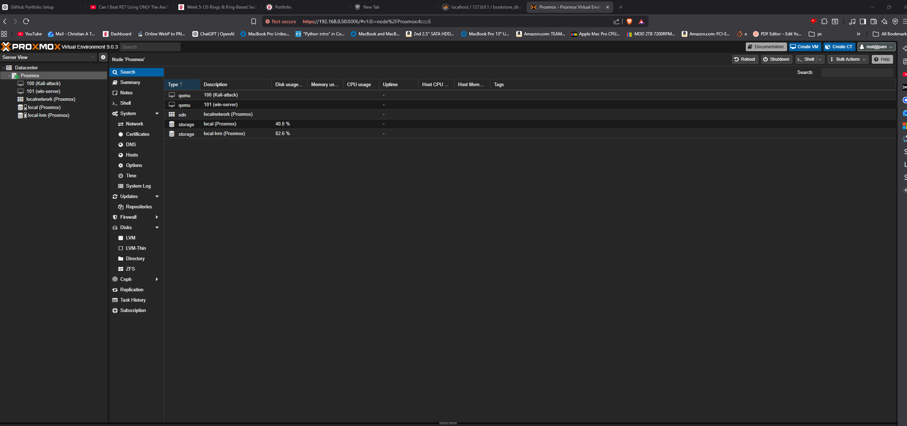
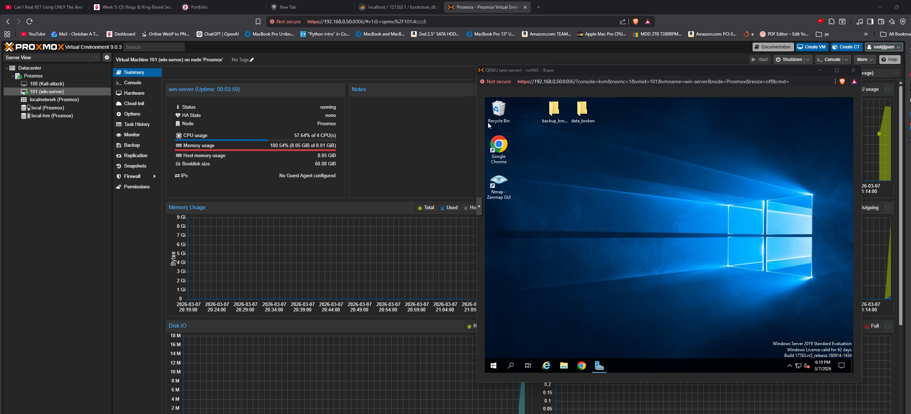
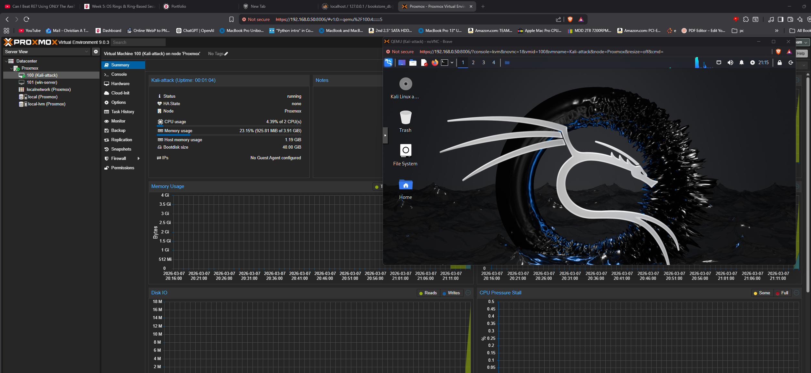
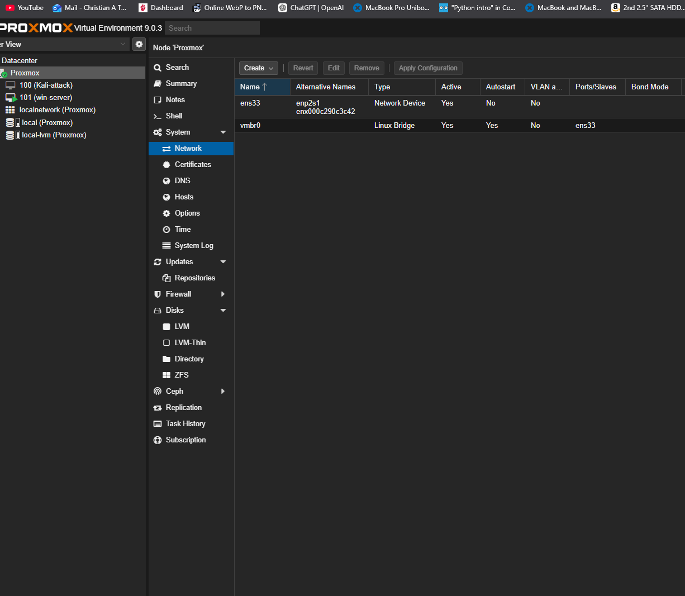
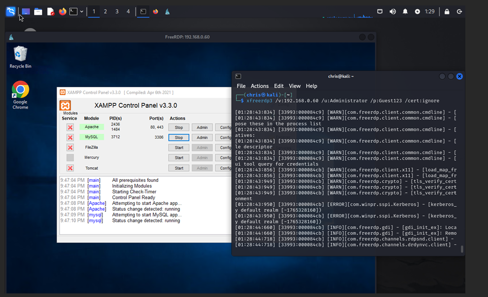

# Proxmox Red Team vs. Blue Team Datacenter Lab

This project is a Proxmox-based red team vs. blue team cybersecurity lab designed to simulate a small enterprise datacenter in a controlled virtual environment. The lab was created to demonstrate practical skills in virtualization, network architecture, system administration, defensive monitoring, and incident response documentation.

## Overview
The purpose of this project was to build a realistic virtual enterprise environment where cybersecurity concepts could be practiced safely and ethically. The lab includes multiple virtual machines, internal networking, and supporting documentation that demonstrate both infrastructure design and security workflow knowledge.

## Objectives
- Build a virtualized enterprise-style lab in Proxmox
- Practice network segmentation and system deployment
- Simulate red team and blue team workflows in a controlled environment
- Document observations, monitoring, and response actions
- Demonstrate hands-on cybersecurity and infrastructure skills

## Environment
- Proxmox virtualization platform
- Windows Server and Kali Linux virtual machines
- Internal virtual networking
- Core services and system administration tools
- Monitoring and documentation for defensive analysis

## My Contribution
I designed the lab layout, deployed and configured the virtual machines, organized the network structure, set up core systems, documented workflows, and recorded observations from testing and monitoring activities.

## Skills Demonstrated
- Virtualization
- Network design
- Windows administration
- Linux administration
- Security monitoring
- Incident response documentation
- Troubleshooting and system configuration

## Screenshots

### Proxmox Datacenter Overview

### Windows Server Virtual Machine

### Kali Linux Virtual Machine

### Proxmox Network Configuration

### Remote Access and Service Validation

## Project Purpose
This lab was built to strengthen practical knowledge of how enterprise systems are deployed, segmented, monitored, and defended in an isolated environment. It also improved my planning, troubleshooting, and technical documentation skills by requiring careful configuration, testing, and analysis across multiple systems.

## Notes
This repository is intended to document the lab design, setup, and security workflow at a high level. Sensitive details and unsafe material have been excluded from the public version.
